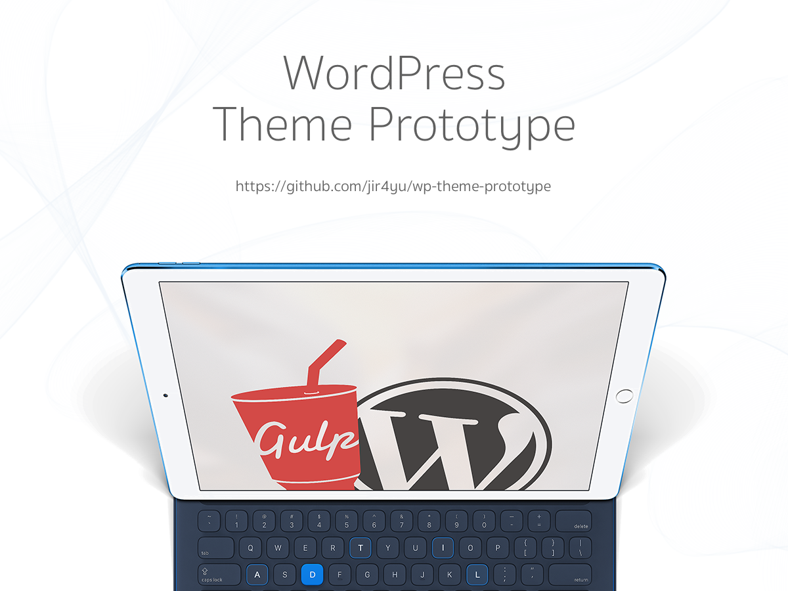

# WordPress Theme Prototype

Start developing new WordPress theme with ease.

This template will help setting up basic file structures and things you need to build your own WordPress theme. We use Gulp generator to compile and compress all assets on the fly.

## What included?

* Modernizr
* Flexibility
* Autoprefixer
* CSS Minify
* JS Uglify
* Imagemin
* Livereload

that's all enough for frontend developer who want to develop a WordPress theme.

## 👨🏻‍💻 Usage

* Clone this project to your `wp-content/themes` and rename it as you want
* run `npm install`
* open **gulpfile.js** and update your banner string
* run `gulp` and start coding
* for production, don't forget to remove remote repository by `git remote remove origin`

## ⚠️  Header comment

Header comment in style.css is important when you developing WordPress theme. because WordPress will use this comment block to identify what theme is it, who made it, etc.

So if header comment is missing or incorrect, you will not see this theme in Appearance > Themes

## Adding Libraries

When you want to use another libraries eg. bootstrap, magnific-popup, owl-carousel etc, to this project. Just install with npm install, bower install or yarn install like you used to. Then add the library stylesheet path to **lib-css** and **javascript** for the scripts.

don't forget to run `npm run vendor` every time when you added new library 🧐

## Troubleshooting

### gem SASS not found!
Just install SASS globally via `gem install sass`

